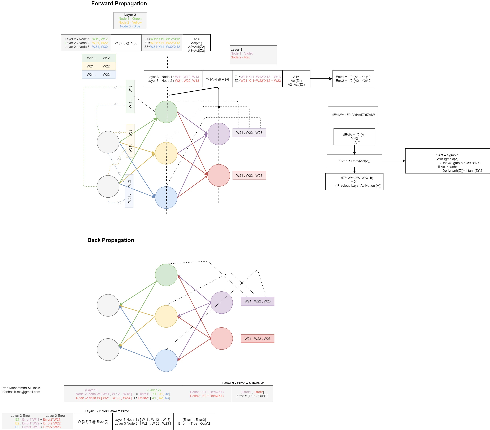

Here I have added my machine learning projects.

1. ANN TF Projects contains projects based on tensorflow and ANN on different datasets.
2. ANN KERAS Pojects KERAS based ANN projects.
3. Machine Learning from scratch contains many algorithms of machine learning I have implemented from scratch.

1.

